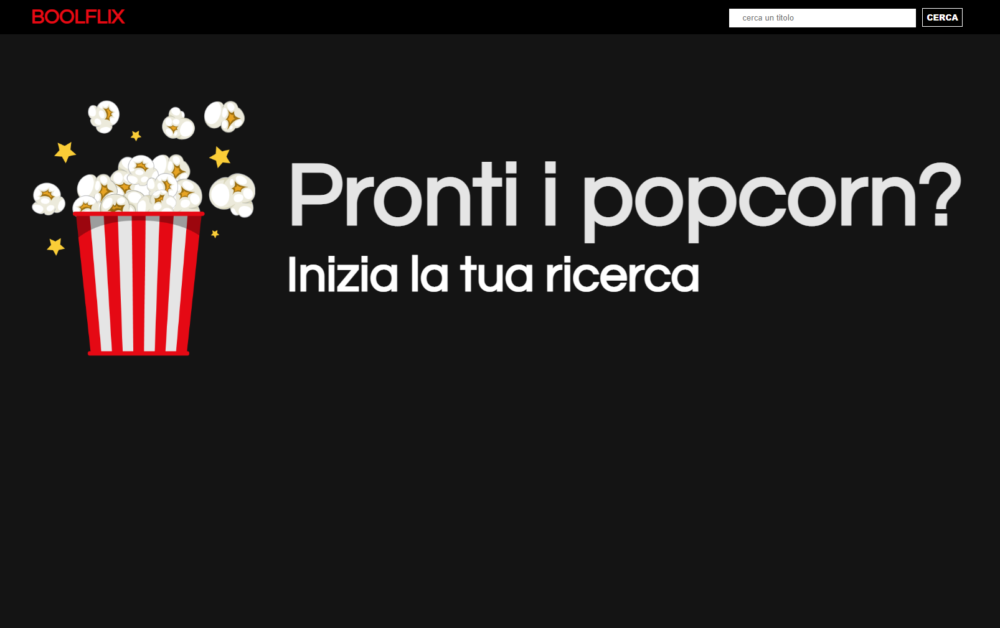

# Boolflix
Boolflix is a personalized replica of Netflix, featuring some modifications. In this project, I have utilized various dependencies such as Sass, Vue, Axios (and Vite as a dev dependency). By making an Axios call to the Movie DB API, I fetch a comprehensive list of movies available on their platform. This approach allows users to access detailed information associated with each movie.

# Vue 3 + Vite

This template should help get you started developing with Vue 3 in Vite. The template uses Vue 3 `<script setup>` SFCs, check out the [script setup docs](https://v3.vuejs.org/api/sfc-script-setup.html#sfc-script-setup) to learn more.

## Recommended IDE Setup

- [VS Code](https://code.visualstudio.com/) + [Volar](https://marketplace.visualstudio.com/items?itemName=Vue.volar) (and disable Vetur) + [TypeScript Vue Plugin (Volar)](https://marketplace.visualstudio.com/items?itemName=Vue.vscode-typescript-vue-plugin).
